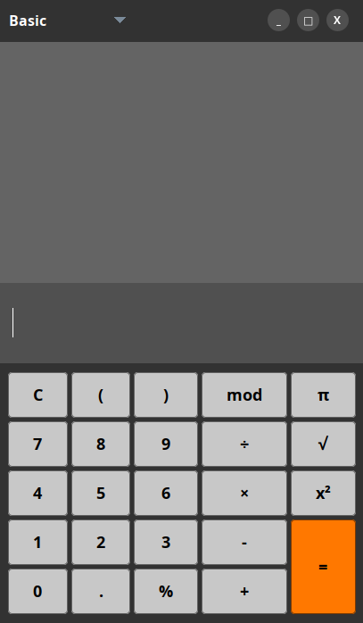

# Java Swing Calculator

This calculator is built with Java Swing. It has a clean UI, history tracking, and custom buttons. Currently supports Basic mode, with Advanced and Programming modes planned.




## Features

- **Basic Arithmetic**: +, -, ×, ÷, %, parentheses, π, square, square root.
- **History Panel**: Shows previous expressions and results with hover effects.
- **Custom Buttons**: Rounded and circular buttons with hover effects.
- **Keyboard Support**: Numeric input, operators, Enter (=), Backspace.
- **Draggable Window**: Undecorated frame with minimize, maximize, and close buttons.


## Getting Started

**1. Clone the repository:**
```bash
git clone <repo-url>
```
**2. Navigate to `src` and compile the project:**
```bash
javac src/**/*.java
```
**3. Run app:**
```bash
java App
```

